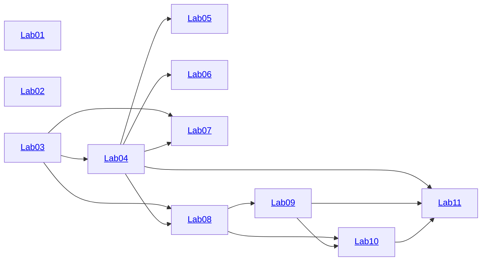

# Translation and Verification Methods

[[RU](README.ru.md)|EN]

This is the set of hands-on excercises to support the lecture course of Translation and Verification Methods taught on
[FIT NSU][FIT] as a part of the [09.03.01] education program.

## Introduction

This set of excercises aims at building the verifying translator from a toy language [Funny](funny.md) into WASM.
The code of these excercises is based on the following technologies:

- Implementation language: [Typescript][TS]
- Execution environment: [Node.js](https://nodejs.org/)
- Compilation target: [Wasm](https://webassembly.org/)
- Theorem prover: [Z3](https://github.com/Z3Prover/z3) via the [z3-solver](https://www.npmjs.com/package/z3-solver) package
- Package manager: [pnpm](https://pnpm.io/)
- Parser library: [Ohm](https://ohmjs.org/)
- Autotests: [Jest](https://jestjs.io/) (may be replaced)
- IDE: [VS Code](https://code.visualstudio.com/) (optional)

## Excercise Evaluation

There are a set of goals for each lab. Every goal is tagged with a mark. In order to get a C mark (3) for the whole practice, one must achieve all the goals tagged with C. To get a B, one needs to achive all the B **and** all the C goals, and so on.
To verify the solutions, one should use the built-in test framework: specify the desired mark in the file [desiredMark.json](desiredMark.json), and run the auto-tests. The tests for the goals above the requested mark would be automatically skipped.

## Contents and Solution Order

The recommended order of implementation is starting from Lab 01 and proceeding sequentially through Lab 11:

- [Lab 01](./lab01/README.md): Addition and Multiplication
- [Lab 02](./lab02/README.md): Reverse Polish Notation
- [Lab 03](./lab03/README.md): Arithmetic Expressions
- [Lab 04](./lab04/README.md): Parsing Arithmetics to AST
- [Lab 05](./lab05/README.md): Compiling to Wasm
- [Lab 06](./lab06/README.md): Symbolic Derivation
- [Lab 07](./lab07/README.md): Algebraic Simplification
- [Lab 08](./lab08/README.md): Parsing Funny
- [Lab 09](./lab09/README.md): Compiling Funny
- [Lab 10](./lab10/README.md): Parsing Funny Annotations
- [Lab 11](./lab11/README.md): Verifying Funny

Some of the labs can be done out-of-order, but many do depend on each other. Here is the complete dependency map:

**Note**: getting the passing mark requires *breadth*, i.e. completing all the excercises on the desired level. The recommended approach to this course is to focus on getting all the labs done with the basic goals (setting the desired mark to 3 and making sure all the tests are passed). Then try to improve the *depth* by changing the desired mark to 4, and fixing the failed tests if any.
This approach ensures smart resource allocation - if one doesn't have enough time to complete all the excercises, they would better get a passing mark than risking to get *half* the labs solved at a perfect level.

## Prerequisites and Installation

1. Download and install Node.js with pnpm for your platform: [https://nodejs.org/en/download][nodejs-dl]
2. Checkout this project.
3. (Optional) download and install VS Code: [https://code.visualstudio.com/Download][vscode-dl]
   - Install recommended extensions. Support for JavaScript and TypeScript is included in VS Code out of the box.
   Two extra tools would be handy
      - *Jest* extension helps you running the unit tests (that are going to be the basis of the excercise acceptance)
      - *Ohm-JS Language* extension helps you to write the PEG grammars extensively used throughout this course

4. Build the labs
   - **VS Code**: press Shift-Ctrl-B.

   - **CLI**:

     1. Make sure the dependencies are installed by running `pnpm -r install` at the project root (only once)
     2. Run terminal at the root folder of any lab; execute `pnpm build`
     3. Running `pnpm -r build` at the workspace root will build all labs at once.

5. Run tests
   **Note**: don't forget to set the desired mark via the `desiredMark.json`!
   - **VS Code**: switch to the Testing tab, hover the project root, click "Run Tests" icon
   - **CLI**: run the `jest` command at the project root

[nodejs-dl]: https://nodejs.org/en/download
[vscode-dl]: https://code.visualstudio.com/Download
[FIT]: https://www.nsu.ru/n/information-technologies-department/
[09.03.01]: https://www.nsu.ru/n/information-technologies-department/education_fit/programs/OOP/09-03-01/piikn/piikn.php
[TS]: https://www.typescriptlang.org/
