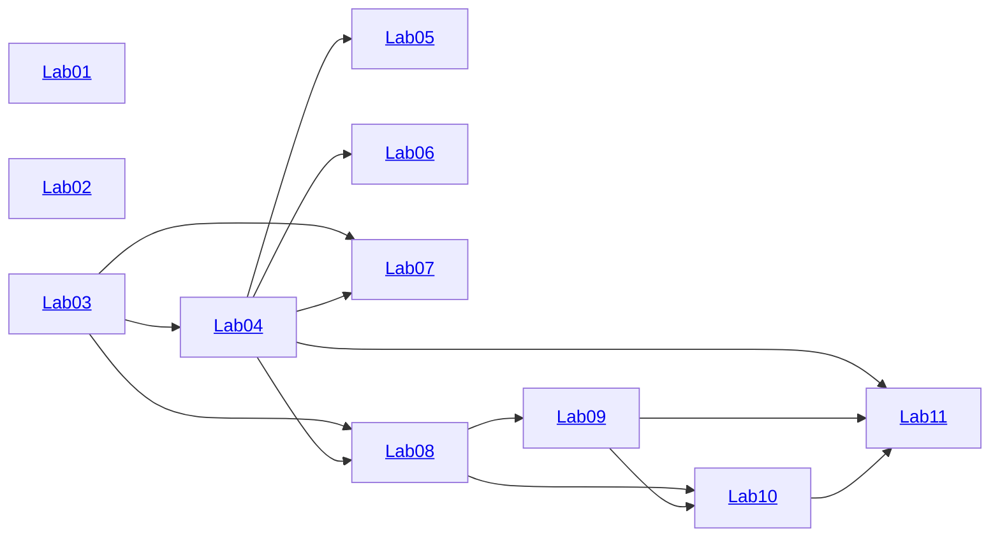

# Методы трансляции и верификации

[RU|[EN](README.md)]

Это набор практических упражнений для поддержки лекционного курса «Методы трансляции и верификации», преподаваемого на
[ФИТ НГУ](https://www.nsu.ru/n/information-technologies-department/) в рамках образовательной программы [09.03.01](https://www.nsu.ru/n/information-technologies-department/education_fit/programs/OOP/09-03-01/piikn/piikn.php).

## Введение

Этот набор упражнений направлен на создание верифицирующего компилятора игрушечного языка [Funny](funny.ru.md) в язык виртуальной машины Wasm.
Код этих упражнений основан на следующих технологиях:

- Язык реализации: [Typescript](https://www.typescriptlang.org/)
- Среда исполнения: [Node.js](https://nodejs.org/)
- Цель компиляции: [Wasm](https://webassembly.org/)
- Доказатель теорем: [Z3](https://github.com/Z3Prover/z3) через пакет [z3-solver](https://www.npmjs.com/package/z3-solver)
- Менеджер пакетов: [pnpm](https://pnpm.io/)
- Библиотека парсеров: [Ohm](https://ohmjs.org/)
- Автотесты: [Jest](https://jestjs.io/) (может быть заменена)
- IDE: [VS Код](https://code.visualstudio.com/) (необязательно)

## Оценка упражнений

В каждой лабораторной работе задан набор целей. Каждая цель помечена оценкой. Чтобы получить оценку 3 (C) за всю практику, необходимо достичь всех целей, отмеченных 3. Чтобы получить 4, необходимо достичь всех целей на 3 **и** всех целей на 4 и т. д.
Для проверки решений следует использовать встроенную тестовую среду: указать желаемую оценку в файле [desiredMark.json](desiredMark.json) и запустить автотесты. Тесты для целей выше запрошенной оценки будут автоматически пропущены.

## Содержание и порядок решения

Рекомендуемый порядок выполнения — последовательно начиная с работы 01 до работы 11:

- [Лабораторная работа 01](./lab01/README.ru.md): Сложение и умножение
- [Лабораторная работа 02](./lab02/README.ru.md): Обратная польская запись
- [Лабораторная работа 03](./lab03/README.ru.md): Арифметические выражения
- [Лабораторная работа 04](./lab04/README.ru.md): Разбор выражений и построение AST
- [Лабораторная работа 05](./lab05/README.ru.md): Компиляция в Wasm
- [Лабораторная работа 06](./lab06/README.ru.md): Символьное дифференцирование
- [Лабораторная работа 07](./lab07/README.ru.md): Алгебраическое упрощение
- [Лабораторная работа 08](./lab08/README.ru.md): Синтаксический анализ Funny
- [Лабораторная работа 09](./lab09/README.ru.md): Компиляция Funny
- [Лабораторная работа 10](./lab10/README.ru.md): Синтаксический анализ аннотаций Funny
- [Лабораторная работа 11](./lab11/README.ru.md): Верификация Funny

Некоторые лабораторные работы можно выполнять не по порядку, но многие зависят друг от друга. Вот полная карта зависимостей:

**Примечание**: для получения проходного балла требуется *широта*, т. е. выполнение всех упражнений на желаемый уровень. Рекомендуемый подход к этому курсу — сосредоточиться на выполнении всех лабораторных работ с основными задачами (установив желаемую оценку 3 и убедиться, что все тесты пройдены). Затем попытайтесь улучшить *глубину*, изменив желаемую оценку на 4 и исправив непрошедшие тесты, если таковые имеются.
Такой подход обеспечивает разумное распределение ресурсов — если у вас недостаточно времени, чтобы выполнить все упражнения, лучше получить проходной балл, чем рисковать, решив *половину* лабораторных работ на идеальном уровне.

## Пререквизиты и установка

1. Загрузите и установите Node.js с pnpm для вашей платформы: [https://nodejs.org/ru/download](https://nodejs.org/ru/download)
2. Ознакомьтесь с этим проектом
3. (Необязательно) загрузите и установите VS Code: [https://code.visualstudio.com/Download](https://code.visualstudio.com/Download)
    - Установите рекомендуемые расширения. Поддержка JavaScript и TypeScript включена в VS Code из коробки.
    Два дополнительных инструмента будут полезны
        - Расширение *Jest* поможет вам запустить модульные тесты (которые станут основой для принятия упражнений)
        - Расширение *Ohm-JS Language* поможет вам написать грамматики PEG, которые широко используются в этом курсе
4. Выполните сборку проекта
    - **VS Code**: нажмите Shift-Ctrl-B.
    - **CLI**: запустите терминал в корневой папке любой лабораторной работы; выполните `pnpm build`.
      1. Убедитесь, что зависимости для всех лабораторных работ установлены, путём запуска `pnpm -r install` в корне проекта (однократно перед первой сборкой)
      2. Запустите терминал в каталоге любой из лабораторных работ и выполните `pnpm build`
      3. Выполнение `pnpm -r build` в корне проекта вызовет сборку всех лабораторных работ
5. Запустите тесты
    **Примечание**: не забудьте установить нужную отметку через `desiredMark.json`!
    - **VS Code**: переключитесь на вкладку «Тестирование», наведите курсор на корень проекта, щелкните значок «Запустить тесты»
    - **CLI**: запустите команду `jest` в корне проекта.
